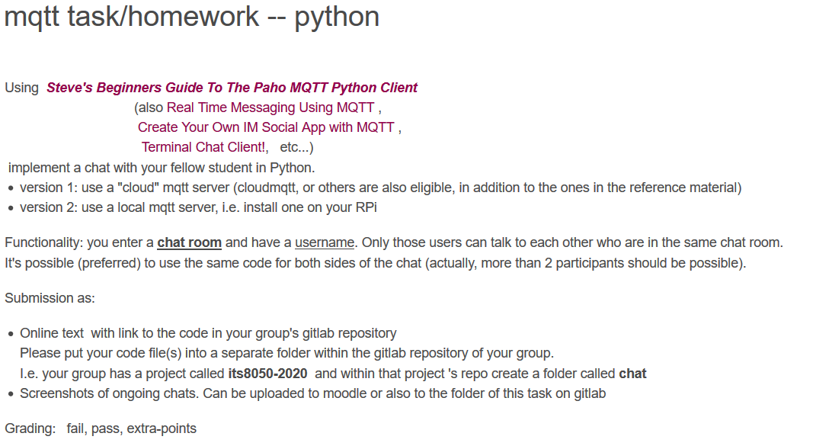
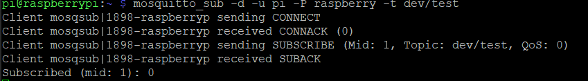
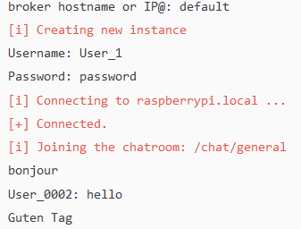
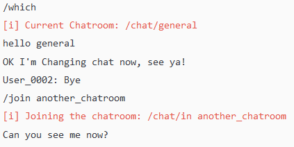
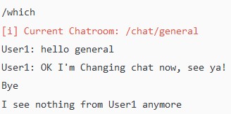
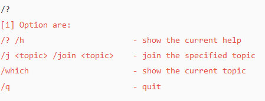
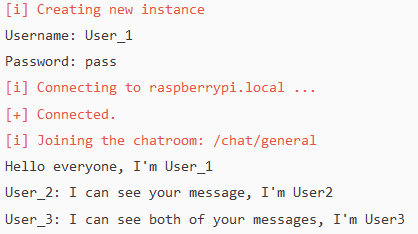
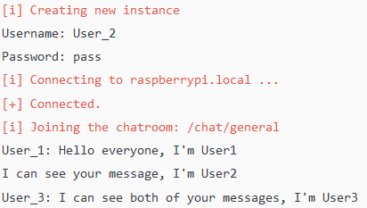
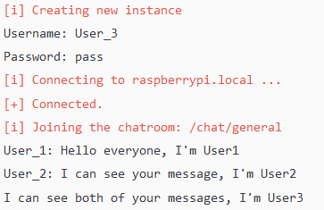

# MQTT echo server over TCP

**Authors**: ITS8050 Group G (Marco Hanisch, Romain Thollot, Antoine Pinon)

## Subject



## Getting started

### Setting up python environment

```bash
sudo apt-get install python
python -m pip install paho-mqtt
```

### Setting up local MOSQUITTO broker on RPi

@see [https://pastebin.com/Etn59ppp](https://pastebin.com/Etn59ppp)

1. Install Mosquitto

```bash
sudo apt-get install mosquitto -y
sudo apt-get install mosquitto-clients
```

2. Configure Mosquitto.

a. Run `sudo nano /etc/mosquitto/mosquitto.conf`

b. Paste the following:

```bash
# Place your local configuration in /etc/mosquitto/conf.d/
#
# A full description of the configuration file is at
# /usr/share/doc/mosquitto/examples/mosquitto.conf.example

pid_file /var/run/mosquitto.pid

persistence true
persistence_location /var/lib/mosquitto/

log_dest file /var/log/mosquitto/mosquitto.log

allow_anonymous false
password_file /etc/mosquitto/pwfile
listener 1883

# include_dir /etc/mosquitto/conf.d
```

3. Setup Mosquitto credentials

```bash
sudo mosquitto_passwd -c /etc/mosquitto/pwfile <MOSQUITTO_USERNAME>
```

In this project, we'll simply use login: pi / raspberry

4. Test the Mosquitto by subscribing to a topic

```bash
mosquitto_sub -d -u <MOSQUITTO_USERNAME> -P <MOSQUITTO_PASSWORD> -t dev/test
```


We can then test our configuration by publishing a message to the topic /dev/test with for example apps such as [Home Assistant](https://www.home-assistant.io/getting-started/).

### Other Free Online MQTT Broker used for testing
- [test.mosquitto.org](mosquitto.org)
- [broker.hivemq.com](hivemq.com)
- [iot.eclipse.org](eclipse.org)

## Demo

### Example 1: Typical conversation between multiple users
*User1* <br>


*User_0002* <br>


### Example 2: Changing chat room
*User1* <br>


*User_0002* <br>


### Example 3: Available Options


### Example 4: With 3 users
*User1* <br>

*User2* <br>

*User3* <br>



## References

- Beginners Guide To The Paho MQTT Python Client*:* [www.steves-internet-guide.com/into-mqtt-python-client/](http://www.steves-internet-guide.com/into-mqtt-python-client/)
- The whole course series from steves-internet: [http://www.steves-internet-guide.com/mqtt-python-beginners-course/](http://www.steves-internet-guide.com/mqtt-python-beginners-course/)
- Paho-mqtt module: [https://pypi.org/project/paho-mqtt/#network-loop](https://pypi.org/project/paho-mqtt/#network-loop)
- Realtime messagine using MQTT*: [https://docs.espressif.com/projects/esp-idf/en/stable/api-reference/protocols/mqtt.html](https://haptik.ai/tech/real-time-messaging-using-mqtt/)*
- Create Your Own IM Social App with MQTT: [https://www.alibabacloud.com/blog/create-your-own-im-social-app-with-mqtt_141275](https://www.alibabacloud.com/blog/create-your-own-im-social-app-with-mqtt_141275)
- Terminal Chat Client: [https://www.hackster.io/acellon/terminal-chat-client-8275a7](https://www.hackster.io/acellon/terminal-chat-client-8275a7)
