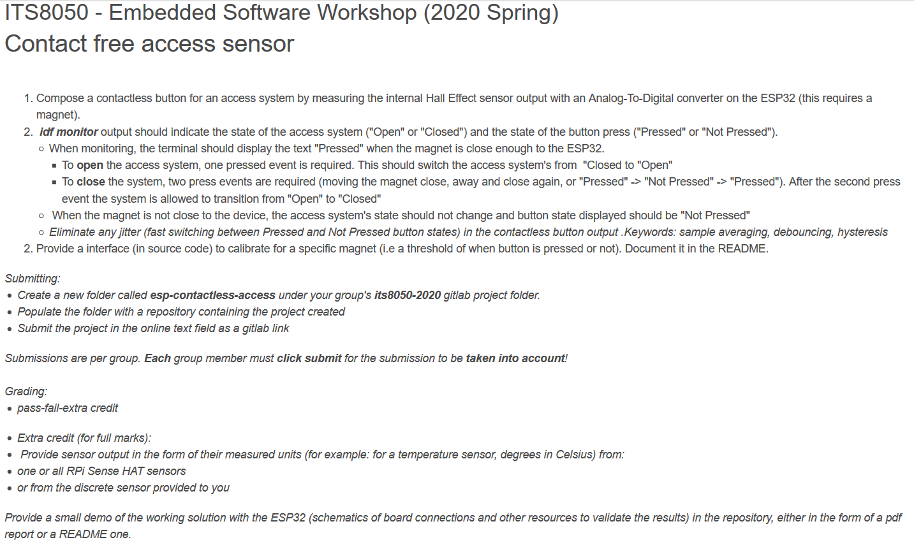
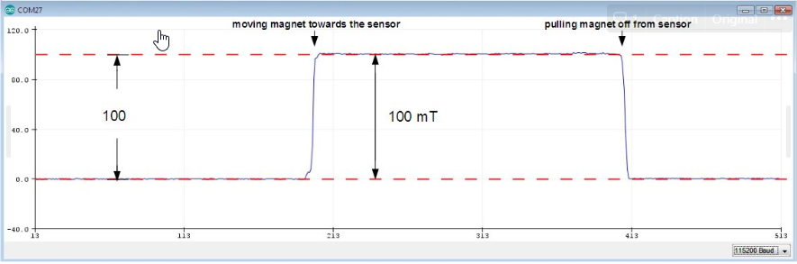
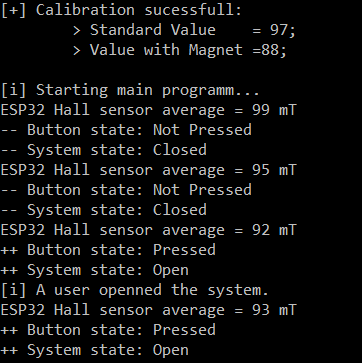
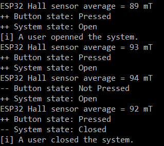
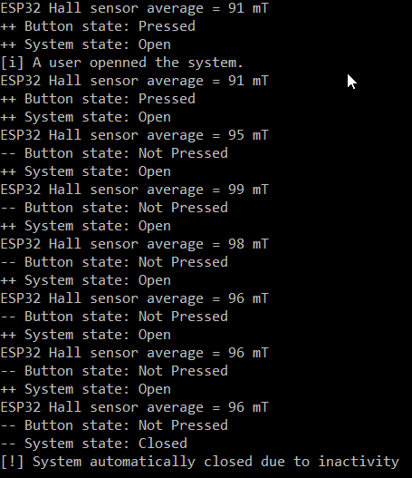

<h1 align="center">
  Contact Free Access Sensor
   
</h1>

<h4 align="center"> ITS8050 - 2nd Project (Spring 2020) </h4>

  
   
   

**Authors**: ITS8050 Group G (Marco Hanisch, Romain Thollot, Antoine Pinon)

## Table of Content

## Subject

## Getting started

### Prerequisites

Having the ESP-IDF Frameworks and toolchain setup on your machine.

[https://docs.espressif.com/projects/esp-idf/en/latest/esp32/get-started/index.html](https://docs.espressif.com/projects/esp-idf/en/latest/esp32/get-started/index.html)

### Installing

    git clone https://github.com/Graydevs/its8050-2020.git

Then issue the standard command to *export IDF variables*, *setting the target*, changes the *board frequency* in the configuration, *build* and *flash* the device:

    %userprofile%\esp\esp-idf\export.bat
    idf.py set-target esp32
    idf.py menuconfig
    # or modifying sdk.cfg CONFIG_ESPTOOLPY_FLASHFREQ_26M=y, CONFIG_ESPTOOLPY_FLASHFREQ="26m"
    %userprofile%\esp\esp-contactless-access\idf.py build
    %userprofile%\esp\esp-contactless-access\idf.py -p <PORT> -b 115200 flash
    %userprofile%\esp\esp-contactless-access\idf.py -p <COM4> -b 115200 monitor

## Demo

To complete this exercise, a relatively strong magnet is required. This was not our case during the testing, that is why we first created a test file running an emultation of our program with differents test sets. By default, the measured hall should look somewhat like this:

### ESP32 Hall Measurement (Arduino IDE)

*Nota on ESP32 sensors*:

The internal temperature sensor -and the ESP32 sensors more generaly- have a big random offset that vary from chip to chip. Thus it can be useful to keep track of temperature deltas, but cannot really infer an absolute temperature. More accurate ways to get the temperature are not yet implemented in esp-idf.

### Calibration and Averaging the Hall values

At the beginning of our programm, we lauch a calibration function that will store the initial hall values with and without the magnet.

The values gathered by the hall sensor can be erratic, starting this project, we saw values ranging from 110 to 75 without any magnets near the system. To solve this issue, we implemented an averaging process. The output values are always averaged over 1000 hall sensor readings giving us  way more stable results.

### Opening the Access System

In this example, the user will put the magnet near the esp32 board on the 3rd tick which will cause the button and access system state to change to 'Pressed' and 'Open' respectively

Please note that we use a constant called `PRECISION` in our algorithm so that values that are slightly higher than the calibrated one can still act on the button/system. In this series of example, it is set to 5.

### Closing the Access System

Here, a user open the system, then take the magnet away, before pressing the button again which cause the system to close. To achieve this, we simply store the `button_state` for *n*, *n-1* and *n-2* and then compare them. If they form a `++ — ++` pattern and the system is `Open`, then we can close the system.

### Closing the Access System for inactivity

In the below example, the user openned the system and let it run without pressing the button for 6 ticks. The system will then automatically close. This behavior is managed by a `timer` variable that is increased each ticks where nothing happens and resetted as soon as the button is pressed.

Again, the values gathered by the hall sensor are not relevant to a real situation with a working magnet but this is just an example to showcase how the program works. The test file have been prooved to work with a lot of other values and so should the main programm do.

## References

- Hall effect: [https://en.wikipedia.org/wiki/Hall_effect](https://en.wikipedia.org/wiki/Hall_effect)
- Analog to Digital Converter: [https://docs.espressif.com/projects/esp-idf/en/latest/esp32/api-reference/peripherals/adc.html](https://docs.espressif.com/projects/esp-idf/en/latest/esp32/api-reference/peripherals/adc.html)
- ADC: [https://github.com/espressif/esp-idf/tree/d85d3d9/examples/peripherals/adc](https://github.com/espressif/esp-idf/tree/d85d3d9/examples/peripherals/adc)

## Built with

- ESP-IDF Framework
- Eclipse C/C++ IDE: [https://www.eclipse.org/downloads/](https://www.eclipse.org/downloads/)
- Visual Studio Code with ESP-IDF extension: [https://github.com/espressif/vscode-esp-idf-extension](https://github.com/espressif/vscode-esp-idf-extension)

## TODOs

- [ ]  Add a sensor test at the beginning of the programm to insure that for example ADC is free and not already in use by another services, ... (Optional)
- [ ]  Add a task that make the LEDs blink when an action on the system is performed. (Optional)
- [ ]  Solve the Task Watchdog Issue (not Critical)
