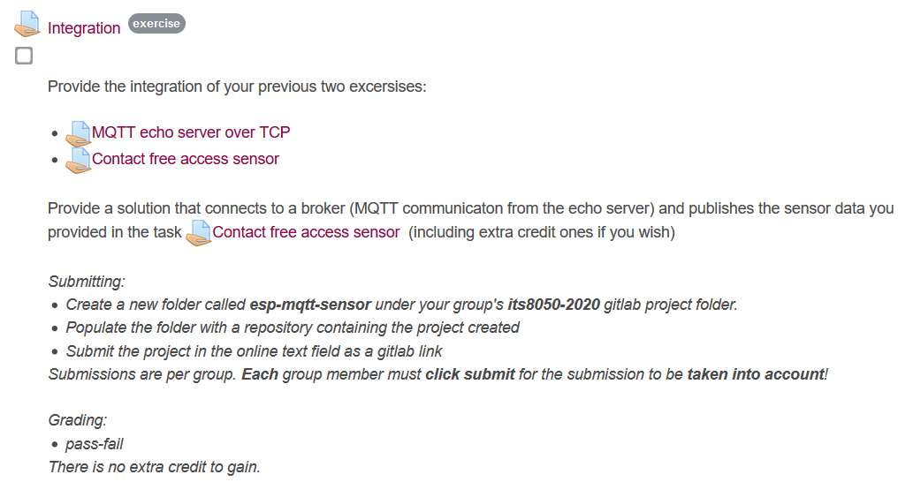

<h1 align="center">
  Integration - Contactless & MQTT
   
</h1>

<h4 align="center"> ITS8050 - Final (Spring 2020) </h4>

  
   
   

**Authors**: ITS8050 Group G (Marco Hanisch, Romain Thollot, Antoine Pinon)

## Subject

## Getting started

### Prerequisites

- Having the ESP-IDF Frameworks and toolchain setup on your machine.

[https://docs.espressif.com/projects/esp-idf/en/latest/esp32/get-started/index.html](https://docs.espressif.com/projects/esp-idf/en/latest/esp32/get-started/index.html)

- An ESP32 board
- An MQTT broker
- A Wifi access point

### Installing

    git clone https://gitlab.cs.ttu.ee/mahani/its8050-2020.git

Then issue the standard command to *export IDF variables*, *setting the target*, changes the *board frequency* in the configuration, *build* and *flash* the device:

    %userprofile%\esp\esp-idf\export.bat
    idf.py set-target esp32
    idf.py menuconfig
    # or modifying sdk.cfg CONFIG_ESPTOOLPY_FLASHFREQ_26M=y, CONFIG_ESPTOOLPY_FLASHFREQ="26m"
    %userprofile%\esp\esp-contactless-access\idf.py build
    %userprofile%\esp\esp-contactless-access\idf.py -p <PORT> -b 115200 flash
    %userprofile%\esp\esp-contactless-access\idf.py -p <COM4> -b 115200 monitor

## References

- *[Connecting to Wifi](https://docs.espressif.com/projects/esp-idf/en/latest/esp32/api-reference/network/esp_wifi.html)*
- *[ESP-IDF MQTT](https://docs.espressif.com/projects/esp-idf/en/stable/api-reference/protocols/mqtt.html)*
- See also "Establishing Wi-Fi or Ethernet Connection" section in *esp-idf/examples/protocols/README.md*

